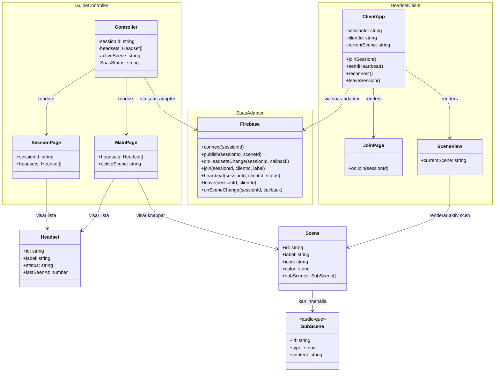

# Klassdiagram — Kalmar Historical Tour

## Tekniker per del

| Del | Teknik |
|-----|--------|
| GuideController | React, Vite |
| HeadsetClient | React, Babylon.js, WebXR |
| SaasAdapter | Firebase Realtime Database |
| Deploy | Netlify |
