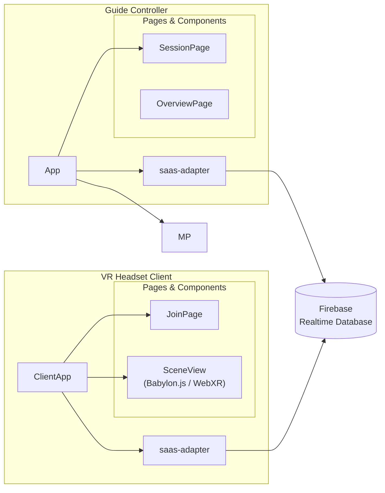

# Komponentdiagram — Kalmar Historical Tour

## Flöde
1. Guide öppnar Controller → session skapas i Firebase
2. Besökare scannar QR → anger session-ID i `JoinPage`
3. `ClientApp` anropar `join()` → headset registreras 
4. `ClientApp` lyssnar via `onSceneChange()` → `SceneView` uppdateras i WebXR
5. `ClientApp` skickar `heartbeat()` periodiskt → status hålls levande
6. Om uppkoppling bryts → `ClientApp` återansluter automatiskt, Controller visar headset som offline under tiden
7. Vid avslut anropas `leave()` → headset tas bort från listan
