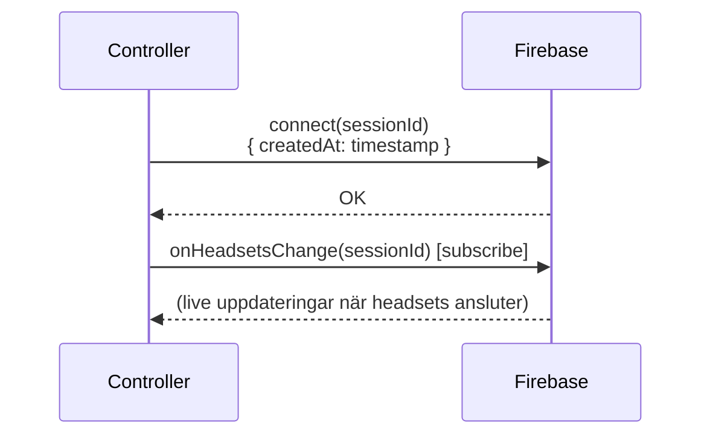
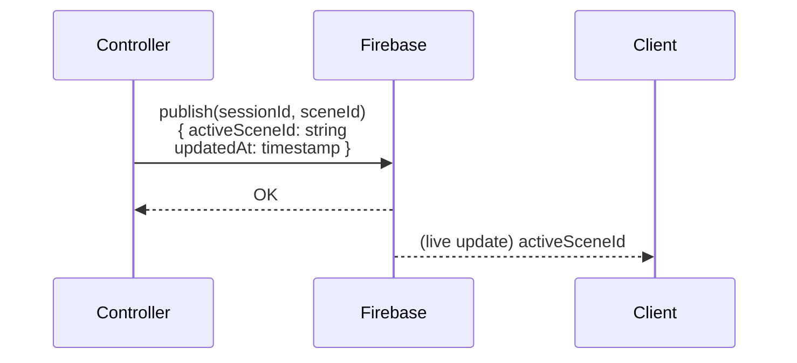
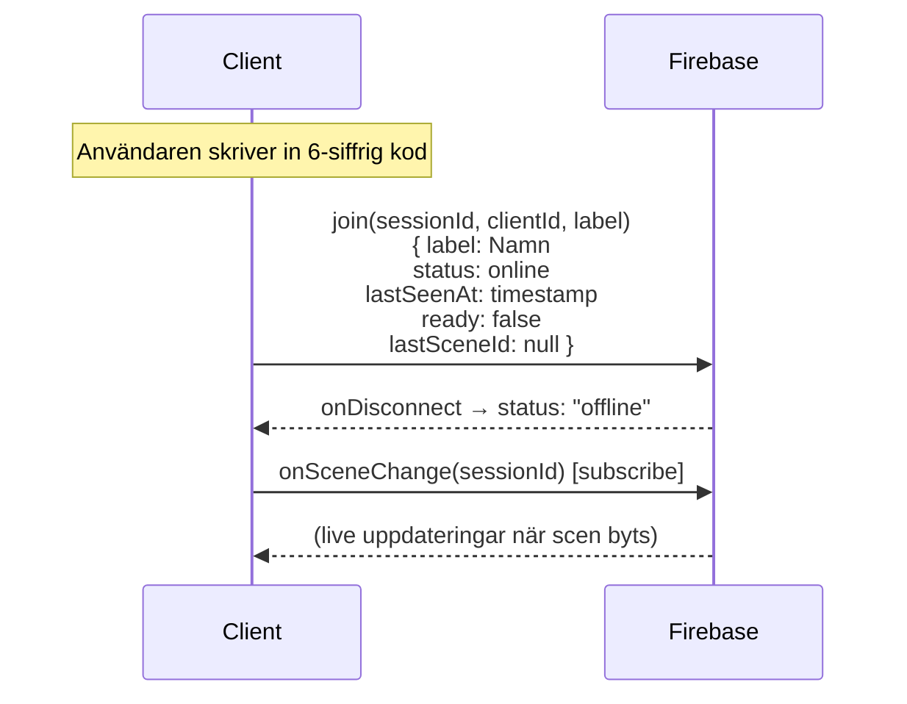
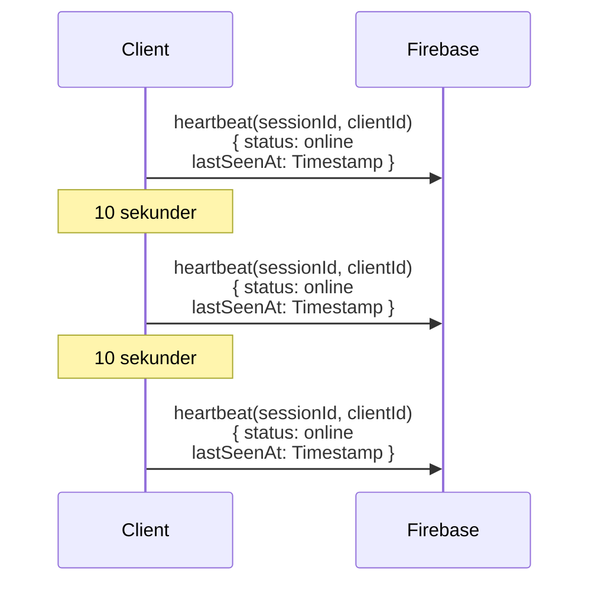
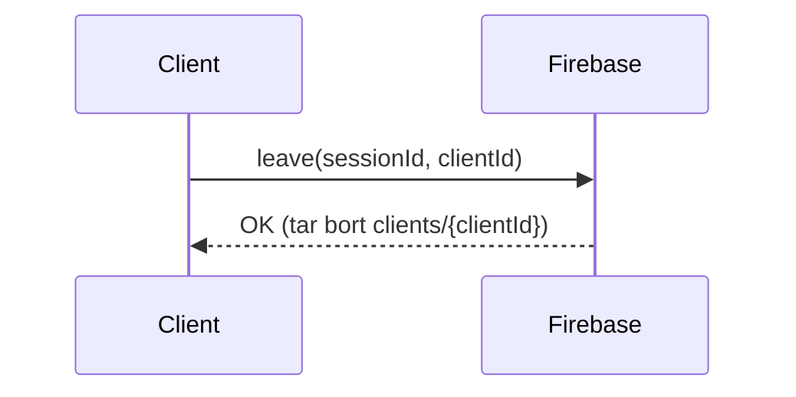
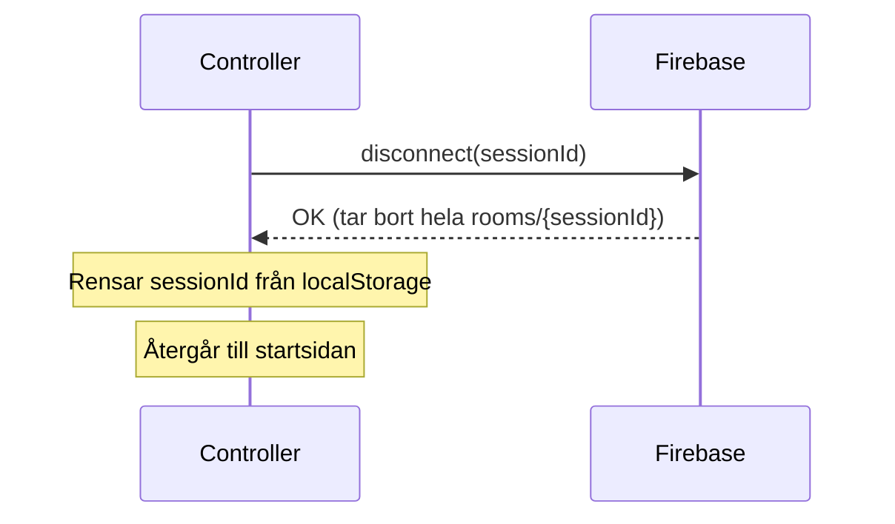

# System Flow — Kalmar Historical Tour

## Datastruktur i Firebase

```
rooms/
  {sessionId}/
    createdAt:     number          ← när rummet skapades
    activeSceneId: string | null   ← aktuell scen
    updatedAt:     number          ← senaste gången scen byttes
    clients/
      {clientId}/
        label:       string        ← visningsnamn, t.ex. "Headset 1"
        status:      string        ← "online" | "offline"
        lastSeenAt:  number        ← senaste heartbeat
        ready:       boolean       ← false, när användare trycker redo true
        lastSceneId: string | null ← scene ID klinten har aktivt
```

---

## Flöde 1 — Controller startar session



---

## Flöde 2 — Controller publicerar scen



---

## Flöde 3 — Client ansluter till session



---

## Flöde 4 — Client skickar heartbeat



---

## Flöde 5 — Client lämnar session



---

## Flöde 6 — Controller avslutar session



> `disconnect` saknas ännu i Firebase.js och behöver läggas till.

---

## API-översikt

| Metod | Anropas av | Vad den gör |
|---|---|---|
| `connect(sessionId)` | Controller | Skapar rum i Firebase |
| `publish(sessionId, sceneId)` | Controller | Byter aktiv scen |
| `onHeadsetsChange(sessionId, cb)` | Controller | Lyssnar på anslutna headsets |
| `disconnect(sessionId)` | Controller | Tar bort hela rummet |
| `join(sessionId, clientId, label)` | Client | Registrerar headset i rummet |
| `heartbeat(sessionId, clientId, status)` | Client | Skickar heartbeat var 10:e sekund |
| `leave(sessionId, clientId)` | Client | Tar bort headset från rummet |
| `onSceneChange(sessionId, cb)` | Client | Lyssnar på scenbyte |

---

## Felhantering
Kan vara redundant med både `heartbeat` och `onDisconnect`, återstår att se?
| Scenario | Beteende |
|---|---|
| Client tappar anslutning | `onDisconnect` sätter `status: "offline"` på klienten |
| Heartbeat uteblir | Framtida feature: controller visar headset som offline efter timeout |
